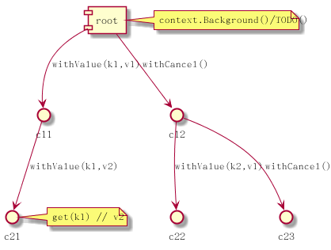
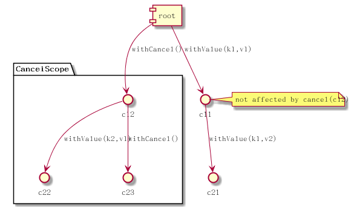

<!-- theme: gaia -->

# Golang Tutorial #2

## Hands on

* coding convention
* package template
* common libraries
* go examples
* go context

---

# golang coding convention

* camelCase
* [official blog](https://github.com/golang/go/wiki/CodeReviewComments)
* package name 單數名詞
* package 內部 variable name 不要重複 prefix, e.g., `chubby.ChubbyFile`
* [error variable naming](https://github.com/golang/go/wiki/Errors): prefix with `err` or `Err`
* Named Result Parameters 個人喜好

---

# golang package

* namespace
  * shared namespace inside package, global var/func/...
* dependency
  * import by package
* only package main is entry
* godoc split page by package
* test split py package

---

# golang package alias

* https://github.com/golang/go/wiki/CodeReviewComments#imports

```golang
import   "lib/math"         // math.Sin
import M "lib/math"         // M.Sin
import . "lib/math"         // Sin    like import math.*
import _ "lib/math"         // only do the init() for math package
```

---

# golang package template/example

* example: [awesome](https://github.com/avelino/awesome-go)
  * [server application](https://github.com/hashicorp/consul)
  * [cmd tools](https://github.com/drone/drone)
  * [library](https://github.com/gin-gonic/gin)
* [project layout](https://github.com/golang-standards/project-layout)

---

# Libraries

* context https://golang.org/pkg/context/
* log: https://github.com/sirupsen/logrus
* exported package concept
* gin github.com/gin-gonic/gin
* https://mholt.github.io/json-to-go/

---

# go example on go routines, channels 用法

* https://blog.golang.org/go-concurrency-patterns-timing-out-and
* https://blog.golang.org/pipelines
* https://talks.golang.org/2012/concurrency.slide

---

# Gin async fast timeout

```golang
ctx.SetTimeout(timeout)
go func() {
    c.Next()
    finish()
}()
<-ctx.Done()
switch ctx.Err() {
// fast return to release http resource, actual handler is still running
case context.DeadlineExceeded:
    GinError(c, ErrTimeout)
    return
default:
    // do nothing, common path
}
```

---

# resource pool (queue/ ring buffer)

```golang
c := make(chan *Session, dbi.MaxConn)

// fetch resource, blocking call
session = <-p.c:

// put back to pool after used
p.c <- session
```

---

# go context

* built-in library [context](https://golang.org/pkg/context/)
* bi-directional tree structure.
* tricky but flexible design.
* default empty ctx implement all methods
* always start with context.Background()/TODO()
* feature context focus on its method

---

# go context tree example



---

# go cancel context struct

* mixin a Context, use chain-map to find all children

```golang
type cancelCtx struct {
	Context

	mu       sync.Mutex            // protects following fields
	done     chan struct{}         // created lazily, closed by first cancel call
	children map[canceler]struct{} // set to nil by the first cancel call
	err      error                 // set to non-nil by the first cancel call
}
```

---

# go cancel

* use chain-map to find all children

```golang
for child := range c.children {
	// NOTE: acquiring the child's lock while holding parent's lock.
	child.cancel(false, err)
}
```

---

# go cancel tree example



---

# go timer context

* mixin a cancelCtx
* only focus on Deadline() and Timer

```golang
// A timerCtx carries a timer and a deadline. It embeds a cancelCtx to
// implement Done and Err. It implements cancel by stopping its timer then
// delegating to cancelCtx.cancel.
type timerCtx struct {
	cancelCtx
	timer *time.Timer // Under cancelCtx.mu.

	deadline time.Time
}
```

---

# go timer.Timer

* timer is a channel waiting event at given time

```golang
// from time.sleep.go
// The Timer type represents a single event.
// When the Timer expires, the current time will be sent on C,
// unless the Timer was created by AfterFunc.
// A Timer must be created with NewTimer or AfterFunc.
type Timer struct {
	C <-chan Time
	r runtimeTimer
}
```

---

# go timer context cancel

* stop timer and cancel its related cancelCtx

```golang
func (c *timerCtx) cancel(removeFromParent bool, err error) {
c.cancelCtx.cancel(false, err)
if removeFromParent {
	// Remove this timerCtx from its parent cancelCtx's children.
	removeChild(c.cancelCtx.Context, c)
}
c.timer.Stop()
c.timer = nil
}
```

---

# go value context

* find parent if not found

```golang
type valueCtx struct {
	Context
	key, val interface{}
}

func (c *valueCtx) Value(key interface{}) interface{} {
	if c.key == key {
		return c.val
	}
	return c.Context.Value(key)
}
```

---

# go context deadline/timeout example

* when timer event trigger, it send cancel signal to its cancelCtx, then Done() received signal

```golang
ctx, cancel := context.WithDeadline(context.Background(), d)
// Even though ctx will be expired, it is good practice to call its
// cancelation function in any case.
defer cancel()
select {
case <-time.After(1 * time.Second):
    fmt.Println("overslept")
case <-ctx.Done():
    fmt.Println(ctx.Err())
}
```

---

# Extend reading

* [Error handling and Go](https://blog.golang.org/error-handling-and-go)
* [Go Errors](https://dave.cheney.net/paste/gocon-spring-2016.pdf)
* [Visualize go routines](https://divan.github.io/posts/go_concurrency_visualize/)
